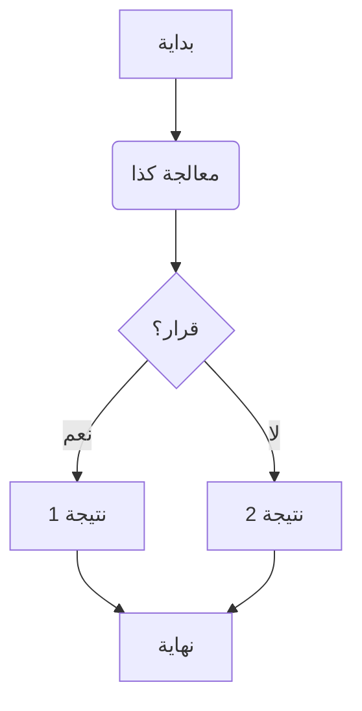
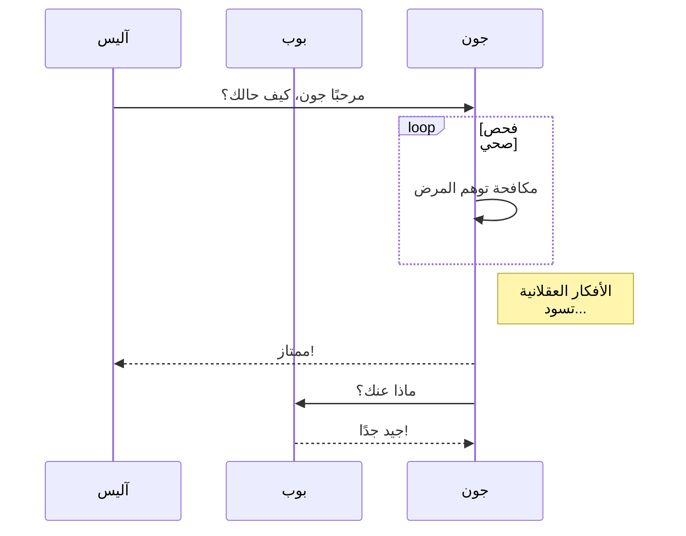

# عرض باللغة العربية: ميزات محرر "على المنصة"

هذا المستند يستعرض الميزات المتنوعة المتوفرة في محرر الماركداون "على المنصة".

## ماركداون قياسي

بالطبع، نحن ندعم **النص العريض**، _النص المائل_، و `الكود المضمن`.

- عنصر قائمة غير مرتبة 1
- عنصر قائمة غير مرتبة 2
  - عنصر متداخل

1. عنصر قائمة مرتبة 1
2. عنصر قائمة مرتبة 2

> هذا اقتباس قياسي.
> يمكن أن يمتد لعدة أسطر.

---

## التنبيهات (Callouts)

التنبيهات رائعة لإبراز المعلومات الهامة.

> [!NOTE]
> هذه ملاحظة. تقدم معلومات إضافية قد تكون مفيدة.

> [!TIP]
> هذه نصيحة مفيدة! استخدمها لتوجيه المستخدمين أو تقديم اقتراحات.

> [!IMPORTANT]
> هذه معلومة هامة يجب ألا يتجاهلها المستخدمون.

> [!WARNING]
> توخ الحذر! التحذيرات تشير إلى مخاطر محتملة أو تفاصيل حرجة.

> [!CAUTION]
> هذا تنبيه حذر، يستخدم غالبًا لتحذيرات أشد من نوع `WARNING`.

## MathJax لمعادلات LaTeX

عرض صيغ رياضية جميلة.

**رياضيات مضمنة:**
المعادلة الشهيرة $E = mc^2$ تربط الطاقة بالكتلة وسرعة الضوء.
جذور المعادلة التربيعية $ax^2 + bx + c = 0$ تُعطى بواسطة $x = \frac{-b \pm \sqrt{b^2-4ac}}{2a}$.

**رياضيات كتلية:**
هوية أساسية في علم المثلثات:

$$
\sin^2\theta + \cos^2\theta = 1
$$

مفكوك تايلور لـ $e^x$:

$$
e^x = \sum_{n=0}^{\infty} \frac{x^n}{n!} = 1 + x + \frac{x^2}{2!} + \frac{x^3}{3!} + \cdots
$$

## رسوم Mermaid.js البيانية

إنشاء رسوم بيانية باستخدام بناء جملة نصي.

**مخطط تدفق:**



**مخطط تسلسل:**



## كتل الأكواد

يتم دعم تمييز بناء الجملة لمختلف اللغات.

**JavaScript:**

```javascript
function greet(name) {
	console.log(`مرحباً، ${name}!`);
}
greet('العالم');
```

**Python:**

```python
def factorial(n):
    if n == 0:
        return 1
    else:
        return n * factorial(n-1)

print(factorial(5)) # الناتج: 120
```

بهذا ينتهي العرض باللغة العربية!
