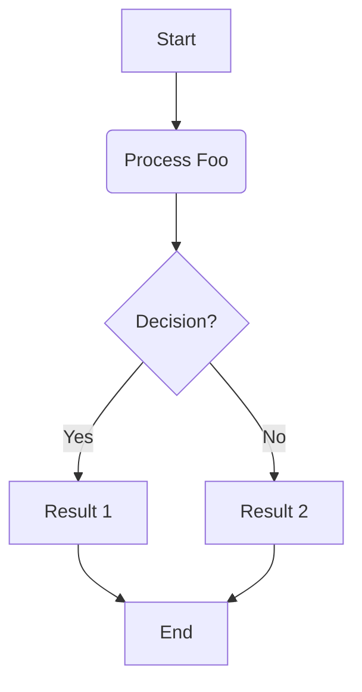
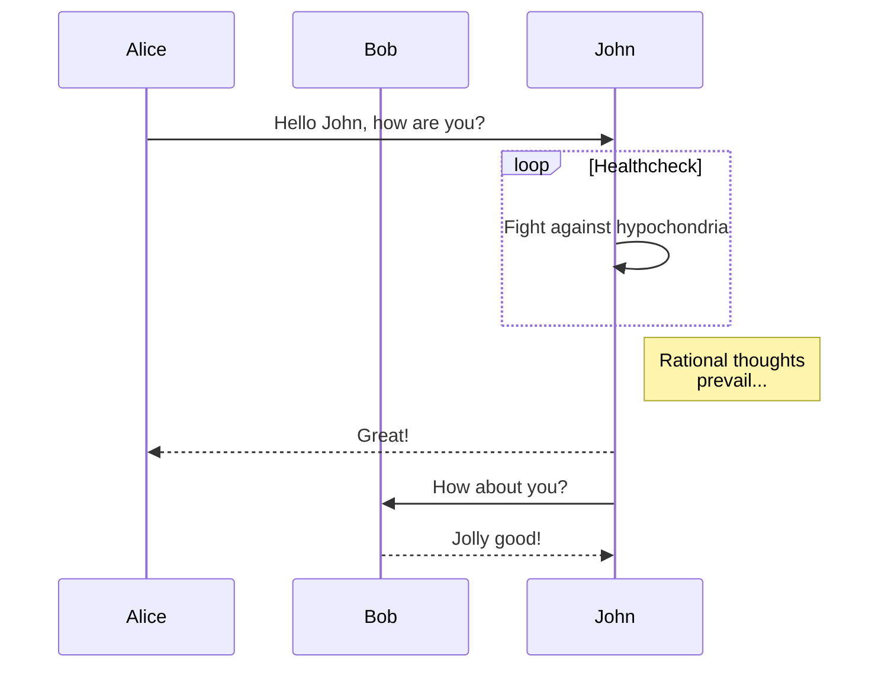

# English Showcase: On The Publish Features

This document demonstrates the various features available in the "On The Publish" Markdown editor.

## Standard Markdown

Of course, we support **bold text**, _italic text_, and `inline code`.

- Unordered list item 1
- Unordered list item 2
  - Nested item

1. Ordered list item 1
2. Ordered list item 2

> This is a standard blockquote.
> It can span multiple lines.

---

## Admonitions (Callouts)

Admonitions are great for highlighting important information.

> [!NOTE]
> This is a note. It provides additional information that might be useful.

> [!TIP]
> Here's a helpful tip! Use these to guide users or offer suggestions.

> [!IMPORTANT]
> This is an important piece of information that users should not miss.

> [!WARNING]
> Exercise caution! Warnings indicate potential pitfalls or critical details.

> [!CAUTION]
> This is a caution block, often used for more severe warnings than the `WARNING` type.

## MathJax for LaTeX Equations

Render beautiful mathematical formulas.

**Inline Math:**
The famous equation $E = mc^2$ relates energy to mass and the speed of light.
The roots of a quadratic equation $ax^2 + bx + c = 0$ are given by $x = \frac{-b \pm \sqrt{b^2-4ac}}{2a}$.

**Block Math:**
A fundamental identity in trigonometry:

$$
\sin^2\theta + \cos^2\theta = 1
$$

The Taylor series expansion for $e^x$:

$$
e^x = \sum_{n=0}^{\infty} \frac{x^n}{n!} = 1 + x + \frac{x^2}{2!} + \frac{x^3}{3!} + \cdots
$$

## Mermaid.js Diagrams

Create diagrams using text-based syntax.

**Flow Chart:**



**Sequence Diagram:**



## Code Blocks

Syntax highlighting for various languages is supported.

**JavaScript:**

```javascript
function greet(name) {
	console.log(`Hello, ${name}!`);
}
greet('World');
```

**Python:**

```python
def factorial(n):
    if n == 0:
        return 1
    else:
        return n * factorial(n-1)

print(factorial(5))
```

This concludes the English showcase!
